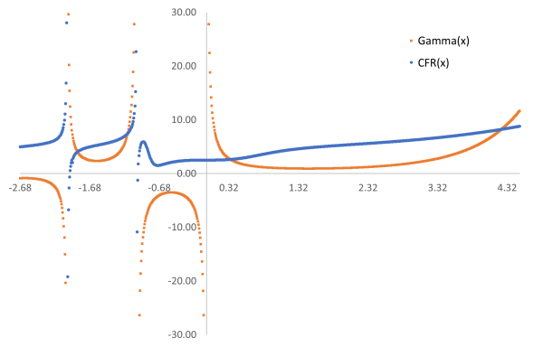

# CFR - Continued Fraction Regression

HEAL.CFR is a C#/.NET implementation of Continued Fraction Regression as described in 
```
Pablo Moscato, Haoyuan Sun, Mohammad Nazmul Haque.
Analytic Continued Fractions for Regression: A Memetic Algorithm Approach.
Expert Systems with Applications 179 (2021): 115018, 10.1016/j.eswa.2021.115018
```
The preprint is available from [arxiv.org](https://arxiv.org/abs/2001.00624)

The code depends on MathNET.Numerics for the Nelder-Mead Simplex algorithm for derivative-free optimization of model parameters.

## Run demo

To run the demo code which tries to reproduce the result for the Gamma function use the following:
```
git clone https://github.com/heal-research/HEAL.CFR
cd HEAL.CFR/src
dotnet build -c Release
cd Demo
dotnet run
``` 

After 200 generations and approximately 200 seconds the result is the following expression with depth=6 and an MSE of 405.6 (NMSE=36%).

```
2.7364 + 0.037962 * x^3 + (-0.54806 + 5.6751 * x^3) /
  (2.3982 + 2.1704 * x^3 + (-2.2502 + 0.47104 * x^3) / 
    (3.9529 + 0.51109 * x^3 + (1.8246 + -0.54095 * x^3) / 
      (1.5209 + 2.8155 * x^3 + (-1.4091 + 0.93799 * x^3) / 
        (1.6708 + -0.64989 * x^3 + (0.13653 + -2.1031 * x^3) / 
          (3.5042 + 3.4784 * x^3 + (0.66668 + -0.71069 * x^3) / 
            (-2.7499 + -0.42627 * x^3))))))
```



# Results for PennML (without Friedman functions)
nr | Instance | Moscato et al. (train) | Median MSE (train) |  | Stdev (train) | Moscato et al. (test) | Median MSE (test) |  | Stdev (test) | count
-- | -------- | ---------------------- | ------------------ |--| ------------- | --------------------- | ----------------- |--| ------------ | -----
192 | vineyard | 4.734 | 3.439 | 1 | 0.656 | 7.993 | 9.493 | 1 | 78.494 | 30
195 | auto_price | 6540000 | 7096209.604 | -1 | 1275695.969 | 7620000 | 8035568.986 | 1 | 2071094.757 | 30
207 | autoPrice | 6350000 | 6297275.053 | 1 | 1116406.049 | 7560000 | 7827328.823 | 1 | 6343703.564 | 30
210 | cloud | 0.095 | 0.061 | 1 | 0.010 | 0.165 | 0.335 | 1 | 0.856 | 30
228 | elusage | 86.7 | 83.154 | 1 | 13.131 | 119 | 128.058 | 1 | 11662.035 | 30
230 | machine_cpu | 2240 | 2290.480 | -1 | 704.100 | 3740 | 4530.875 | 1 | 20231.100 | 30
485 | a.vehicle | 21700 | 19799.554 | 1 | 6464.678 | 37300 | 37382.613 | 1 | 26984.828 | 30
519 | vinnie | 2.375 | 2.293 | 1 | 0.099 | 2.371 | 2.514 | 1 | 0.351 | 30
522 | pm10 | 0.681 | 0.647 | 1 | 0.042 | 0.693 | 0.683 | -1 | 0.107 | 30
523 | a.neavote | 0.725 | 0.737 | -1 | 0.079 | 0.903 | 0.755 | -1 | 0.454 | 30
527 | a.elec2000 | 4090000 | 2369044.844 | 1 | 18009766.336 | 14200000 | 13654235.001 | -1 | 106630949.380 | 30
542 | pollution | 1290 | 1062.995 | 1 | 322.863 | 2400 | 2180.441 | -1 | 3703.602 | 30
547 | no2 | 0.303 | 0.282 | 1 | 0.018 | 0.32 | 0.304 | -1 | 0.070 | 30
556 | a.apnea2 | 1170000 | 910053.603 | 1 | 157977.790 | 1170000 | 1374304.924 | 1 | 473594.166 | 30
557 | a.apnea1 | 1160000 | 964706.233 | 1 | 120008.381 | 1210000 | 1057566.636 | -1 | 432611.656 | 30
561 | cpu | 637 | 700.402 | -1 | 966.492 | 1330 | 2101.871 | 1 | 100387.980 | 30
659 | sl_ex1714 | 1110000 | 1522781.116 | -1 | 1906213.556 | 1860000 | 2791205.448 | 1 | 3218940.610 | 30
663 | rabe_266 | 8.381 | 5.935 | 1 | 6.275 | 9.641 | 8.240 | -1 | 35.170 | 30
665 | sl_case2002 | 55.722 | 48.428 | 1 | 5.495 | 59.521 | 59.223 | -1 | 95.357 | 30
666 | rmftsa_ladata | 3.135 | 3.389 | -1 | 0.479 | 3.208 | 3.774 | 1 | 5440.485 | 30
678 | v.env. | 7.38 | 6.690 | 1 | 0.886 | 8.412 | 9.895 | 1 | 765.319 | 30
687 | sl_ex1605 | 95.07 | 76.615 | 1 | 8.889 | 103.057 | 123.636 | 1 | 66.445 | 30
690 | v.galaxy | 800 | 853.299 | -1 | 67.139 | 886 | 930.552 | 1 | 4994.997 | 30
695 | chatfield_4 | 247 | 220.129 | 1 | 20.880 | 296 | 287.365 | -1 | 1429.303 | 30
706 | sl_case1202 | 2170 | 2214.299 | -1 | 352.884 | 2800 | 2901.182 | 1 | 1284.255 | 30
712 | chs_geyser1 | 36.539 | 32.972 | 1 | 2.298 | 38.619 | 38.342 | -1 | 7.085 | 30
1027 | ESL | 0.265 | 0.252 | 1 | 0.018 | 0.309 | 0.325 | 1 | 0.203 | 30
1028 | SWD | 0.484 | 0.473 | 1 | 0.028 | 0.488 | 0.475 | -1 | 0.043 | 30
1029 | LEV | 0.409 | 0.412 | -1 | 0.034 | 0.418 | 0.451 | 1 | 0.054 | 30
1030 | ERA | 2.553 | 2.492 | 1 | 0.099 | 2.665 | 2.622 | -1 | 0.190 | 30
1089 | USCrime | 202 | 222.194 | -1 | 89.198 | 372 | 621.820 | 1 | 124476.809 | 30
1096 | FacultySalry | 1.751 | 1.860 | -1 | 0.628 | 3.127 | 3.870 | 1 | 8.632 | 30
 |  |  |  |  |  |  |  |  |  | 
 |  |  |  | 11 |  |  |  | 12 |  | 
 |  |  |  | 21 |  |  |  | 20 |  | 

