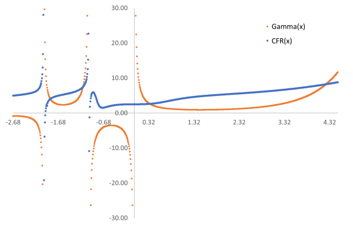

# CFR - Continued Fraction Regression

HEAL.CFR is a C#/.NET implementation of Continued Fraction Regression as described in 
```
Pablo Moscato, Haoyuan Sun, Mohammad Nazmul Haque.
Analytic Continued Fractions for Regression: A Memetic Algorithm Approach.
Expert Systems with Applications 179 (2021): 115018, 10.1016/j.eswa.2021.115018
```
The preprint is available from [arxiv.org](https://arxiv.org/abs/2001.00624)

The code depends on MathNET.Numerics for the Nelder-Mead Simplex algorithm for derivative-free optimization of model parameters.

## Run demo

To run the demo code which tries to reproduce the result for the Gamma function use the following:
```
git clone https://github.com/heal-research/HEAL.CFR
cd HEAL.CFR
dotnet build -c Release
cd Demo
dotnet run
``` 

After 200 generations and approximately 200 seconds the result is the following expression with depth=6 and an MSE of 405.6 (NMSE=36%).

```
2.7364 + 0.037962 * x^3 + (-0.54806 + 5.6751 * x^3) / (2.3982 + 2.1704 * x^3 + (-2.2502 + 0.47104 * x^3) / (3.9529 + 0.51109 * x^3 + (1.8246 + -0.54095 * x^3) / (1.5209 + 2.8155 * x^3 + (-1.4091 + 0.93799 * x^3) / (1.6708 + -0.64989 * x^3 + (0.13653 + -2.1031 * x^3) / (3.5042 + 3.4784 * x^3 + (0.66668 + -0.71069 * x^3) / (-2.7499 + -0.42627 * x^3))))))
```

